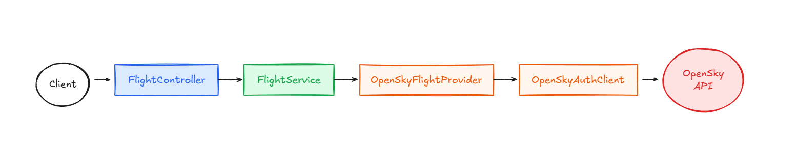

# API Service

REST API for flight tracking data. Fetches live flight information from OpenSky Network and exposes it through HTTP endpoints.

## How It Works

```
Client → FlightController → FlightService → OpenSkyFlightProvider → OpenSkyAuthClient → OpenSky API
```

### Request Flow

1. **FlightController** - Receives HTTP requests, validates input, returns responses
2. **FlightService** - Orchestrates business logic, handles caching, error handling
3. **OpenSkyFlightProvider** - Makes HTTP calls to OpenSky API, transforms their data to our domain model
4. **OpenSkyAuthClient** - Manages OAuth2 tokens, handles authentication

### Why This Structure?

**Separation of Concerns**
- Controllers don't know about OpenSky - they just call FlightService
- FlightService doesn't know about HTTP or authentication - it just calls the provider
- OpenSky integration is isolated - swapping to a different flight API only affects the integration package

**Easy to Test**
- Mock the provider to test FlightService without hitting real APIs
- Mock FlightService to test controllers without any external dependencies

**Clear Responsibilities**
- `controller/` - HTTP layer
- `service/` - Business logic
- `integration/opensky/` - External API integration
- `domain/` - Our data models
- `config/` - Spring configuration

## Package Structure

```
api/
├── ApiApplication.java
├── controller/          (HTTP endpoints)
├── service/             (Business logic)
├── domain/              (Flight models)
├── integration/opensky/ (OpenSky API client)
└── config/              (Spring beans, cache)
```

## Running Locally

```bash
./gradlew :api-service:bootRun
```

Requires OpenSky credentials in `application.yml`:
```yaml
opensky:
  client-id: your-client-id
  client-secret: your-client-secret
```